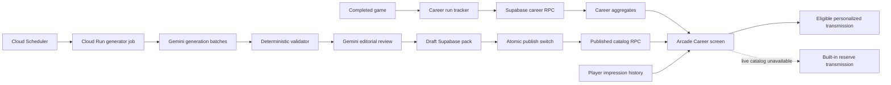

# Project Neon Fang Arcade Announcer

This guide explains how the Snake Arcade Announcer generates new material, publishes it safely, and turns player career statistics into live in-game transmissions.

The announcer is a template-based live service. Gemini does **not** write a message for an individual player in real time, and it never receives a player's identity or career history. Instead, a private scheduled job periodically creates a reusable pack of reviewed templates. The game combines an eligible template with the signed-in player's own statistics in the browser.

## System overview



There are three cooperating parts:

1. **The game records career facts.** Runs contribute food, active play time, distance, turns, deaths, favorite themes, favorite controls, and other lifetime totals.
2. **The private generator publishes template packs.** Cloud Run calls Gemini through Vertex AI, validates the result, and stores only approved templates in Supabase.
3. **The game selects and renders a line.** When the player opens Arcade Career, the game retrieves their statistics, the published catalog, and their recent announcer history, then chooses an eligible line.

## Important design principle: Gemini does not serve players directly

The browser never calls Gemini. This provides several advantages:

- no Gemini or Google credentials are exposed in GitHub Pages;
- opening Arcade Career does not incur a Gemini request or per-player AI cost;
- one generated pack can serve every player;
- a temporary Gemini or Cloud Run outage does not break the game;
- player statistics and identity are not sent to Gemini;
- all generated material can be validated before players see it.

## Repository map

| File | Responsibility |
|---|---|
| `services/announcer-generator/index.mjs` | Cloud Run job entry point, Gemini calls, batch orchestration, quality report, and publication |
| `services/announcer-generator/prompt.mjs` | Project Neon Fang voice, gold-standard examples, placeholder contract, and editorial-review prompt |
| `services/announcer-generator/validator.mjs` | Deterministic structural, safety, grounding, unit, and repetition checks |
| `services/announcer-generator/validator.test.mjs` | Generator contract and regression tests |
| `services/announcer-generator/Dockerfile` | Cloud Run container definition |
| `supabase-player-career-announcer.sql` | Career tables, announcer tables, RLS, RPCs, history, and pack publication function |
| `src/stats/career-run-tracker.js` | Captures one run's active time, movement, turns, length, controls, and finish result |
| `src/stats/career-stats-service.js` | Sends career runs, queues failed submissions, loads totals, and maintains an offline snapshot |
| `src/stats/announcer-service.js` | Browser-side RPC wrapper for catalog and impression history |
| `src/stats/arcade-announcer.js` | Conditions, cooldowns, weighted selection, placeholder rendering, and built-in reserve copy |
| `src/ui/career-stats-panel.js` | Loads the three data sources and displays the selected transmission |
| `GOOGLE-CLOUD-ANNOUNCER-SETUP.md` | Initial Google Cloud, Secret Manager, deployment, and Scheduler setup |

## 1. How career facts are collected

At the beginning of an eligible run, `career-run-tracker.js` starts a new immutable run record. During play it tracks:

- game mode and theme;
- control method and mixed-control use;
- active, unpaused gameplay time;
- accepted movement cells;
- accepted direction changes;
- longest snake length;
- wall or self collision;
- final score and finish reason.

Golden backdoor runs are deliberately excluded.

At game over, the game submits the snapshot through `submit_career_run`. Each run has a unique UUID, so replaying the same request is idempotent and cannot increment the career twice. Supabase stores the run and updates the player's aggregate career row.

If submission fails because the player is offline, the browser queues up to 50 pending runs and retries them after reconnection or identity restoration. Career totals are also cached per player for an offline Arcade Career snapshot.

These career statistics are playful lifetime telemetry. They are not a replacement for the authoritative replay verification used by ranked Daily Run or Live Vs results.

## 2. How a new announcer pack is generated

The Cloud Run job is a private batch process. Its current prompt contract is versioned as:

```text
arcade-announcer-v3-neon-fang
```

Every meaningful prompt or validator contract change should increment `PROMPT_VERSION`. This makes it possible to tell exactly which rules produced a published pack.

### Generation batches

The job requests four focused batches:

1. career, runs, and theme;
2. food, time, and distance;
3. deaths and controls;
4. Daily Run and Live Vs.

Each batch initially requests 12 candidates. If that Gemini request fails, the job retries the batch with a smaller target of 10. A batch must retain at least six structurally valid lines or the entire run stops without changing the live pack.

The focused batches help Gemini develop distinct jokes around a small group of related statistics instead of producing one broad, repetitive list.

### Voice contract

The prompt defines the announcer as a deadpan arcade sports commentator with royal-historian confidence and the paperwork obsession of an exhausted civil servant. Each line needs:

- a setup grounded in a supported statistic or an explicit new-player condition;
- a genuine comedic turn;
- a recognizable Project Neon Fang narrator attitude.

Gold-standard examples demonstrate mechanisms such as mock rivalry, personified objects, investigations, bureaucracy, and dramatic understatement. Gemini is told to learn from those mechanisms without copying the wording.

Generic achievement language such as “Great job,” “Keep it up,” “Snake legend,” or empty praise is explicitly rejected.

### Supported placeholders

Templates may use only:

```text
{total_food}       {active_ms}       {total_runs}
{total_deaths}     {wall_deaths}     {self_deaths}
{distance_cells}   {total_turns}     {longest_snake}
{daily_runs}       {daily_wins}      {vs_rounds}
{vs_wins}          {display_name}    {initials}
{favorite_theme}   {favorite_control}
```

`{active_ms}` is a semantic name, not its display format. The game renders it as a complete phrase such as `5 minutes` or `1.5 hours`. A template must therefore never append `milliseconds`, `seconds`, `minutes`, `hours`, or `ms`. The v3 deterministic gate rejects that mistake, and the client renderer also repairs it defensively if malformed legacy content is encountered.

### Conditions

Every generated line carries one eligibility condition:

```json
{
  "metric": "wall_deaths",
  "operator": "gte",
  "threshold": 10
}
```

Supported operators are `gte`, `lte`, `gt`, `lt`, and `eq`. A condition ensures that the template's claim is justified before it can be shown. Missing Daily or Vs facts are treated as unknown rather than misleading zeroes.

## 3. Quality gates

Generated content must pass two different gates.

### Deterministic validation

Code rejects a candidate when it has any of the following problems:

- invalid or previously used message key;
- invalid family key or category;
- category outside the requested batch;
- unsupported placeholder;
- malformed condition, weight, cooldown, or impression limit;
- blocked vocabulary, URL, or unsafe subject;
- generic achievement copy;
- no visible grounding in player data;
- an extra unit appended to `{active_ms}`;
- too many lines using the same joke family.

This gate is deterministic, testable, and cannot be persuaded by the model.

### Gemini editorial review

A separate low-temperature Gemini call acts as Project Neon Fang's head comedy editor. It independently scores:

- data fidelity;
- comedic craft;
- Neon Fang voice;
- originality;
- clarity;
- placeholder formatting;
- safety.

Creative dimensions must score at least 4/5. Safe but boring copy is rejected. The reviewer is explicitly told that a high rejection rate is preferable to lowering the standard.

At least 24 approved lines are required by default. `MIN_PUBLISHABLE_LINES` may raise this threshold, but code will never allow it below 20.

## 4. How publication and retirement work

After the gates pass, the job:

1. creates an `arcade_announcer_packs` row with `draft` status;
2. stores the approved `arcade_announcer_lines` rows;
3. calls `publish_arcade_announcer_pack(pack_id)`;
4. retires every previously published pack;
5. marks the new draft as the sole published pack.

The live-pack switch happens in one database transaction. If the switch fails, the previous published pack remains active. An incomplete new pack may remain as a draft for diagnosis, but it is never returned to players.

Retired packs are retained for audit history. They show which prompt version and model produced the material, when it was active, and why generated candidates were rejected.

The pack's `quality_report` records:

- generated candidate count;
- generation-stage deterministic rejections;
- final deterministic acceptance and rejection details;
- Gemini editorial rejection reasons;
- published line count.

## 5. How the game consumes the pack

When an identified player opens Arcade Career, the panel concurrently requests:

1. the player's aggregate career statistics;
2. the current published announcer catalog;
3. that player's recent announcer impression history.

The browser uses authenticated Supabase RPCs. It cannot read the protected announcer or history tables directly.

### Eligibility and selection

`selectCatalogAnnouncerLine` filters the catalog by:

- condition eligibility;
- family cooldown;
- per-line maximum impressions;
- availability of the required statistic.

It then performs weighted deterministic selection. The seed includes the player identity, UTC date, and current run total. This produces stable daily behavior without making every player receive the same line.

After selection, the browser substitutes placeholders with formatted player values and records the impression asynchronously. Cooldowns operate at the family level, preventing several variations of the same underlying joke from appearing too close together.

### Reserve transmissions

The game contains a small built-in catalog in `src/stats/arcade-announcer.js`. It is used when:

- Supabase is temporarily unavailable;
- no live catalog can be loaded;
- no live line is currently eligible.

The UI labels generated material as `LIVE ARCADE TRANSMISSION` and local fallback material as `CABINET RESERVE TRANSMISSION`.

## 6. Security model

- Cloud Run uses its service account to access Vertex AI; no Gemini API key is embedded in the repository.
- The Supabase service-role key is stored in Google Secret Manager and injected only into the Cloud Run job.
- GitHub Pages contains only the public Supabase client credentials.
- Announcer pack, line, and impression-history tables use Row Level Security and revoke direct browser access.
- Authenticated players use narrow `security definer` RPCs to read the active catalog, read their own history, and record impressions.
- The generator is the only component allowed to publish a pack.

Never commit a service-account JSON file, Gemini key, or Supabase service-role key.

## 7. What must be updated for each kind of change

| Change | Required action |
|---|---|
| Generate another content pack with unchanged code | Execute the existing Cloud Run job |
| Change prompt, examples, validator, generator code, dependencies, or Dockerfile | Commit and push, pull the source branch in Cloud Shell, redeploy the Cloud Run job, then execute it manually |
| Change only Cloud Run environment variables | Update the existing job with `gcloud run jobs update --update-env-vars` |
| Change Supabase tables, constraints, RLS, or RPCs | Run the updated SQL in Supabase, then test the job and game |
| Change browser selection, rendering, fallback copy, or Arcade Career UI | Build, test, and deploy the GitHub Pages website |
| Publish a successful new pack | No GitHub Pages deployment is needed; the game reads the new pack on the next Arcade Career load |
| Update the Cloud Run job configuration | No Scheduler change is needed; the Scheduler invokes the updated job definition |

Use the source branch containing `services/announcer-generator`, normally `main`. The `gh-pages` branch is the built website and is not the generator's source of truth.

## 8. Deploying a generator-code update

From a current repository clone in Google Cloud Shell:

```bash
git pull origin main

export PROJECT_ID="loyal-copilot-156714"
export RUN_REGION="europe-west1"
export RUNTIME_SA="snake-announcer-generator@${PROJECT_ID}.iam.gserviceaccount.com"

gcloud config set project "$PROJECT_ID"

gcloud run jobs deploy snake-announcer-generator \
  --source=services/announcer-generator \
  --project="$PROJECT_ID" \
  --region="$RUN_REGION" \
  --service-account="$RUNTIME_SA" \
  --set-env-vars="GOOGLE_CLOUD_PROJECT=${PROJECT_ID},GOOGLE_CLOUD_LOCATION=global,GEMINI_MODEL=gemini-2.5-flash,SNAKE_SUPABASE_URL=https://suuwudlnsapyvthjscwp.supabase.co" \
  --set-secrets="SNAKE_SUPABASE_SERVICE_ROLE_KEY=snake-supabase-service-role:latest" \
  --max-retries=1 \
  --task-timeout=10m
```

Always run a new deployment manually before relying on its next scheduled execution:

```bash
gcloud run jobs execute snake-announcer-generator \
  --project="$PROJECT_ID" \
  --region="$RUN_REGION" \
  --wait
```

A normal execution makes several Gemini calls and can take a few minutes.

## 9. Generating a fresh pack without changing code

Do not redeploy. Execute the existing job:

```bash
gcloud run jobs execute snake-announcer-generator \
  --project=loyal-copilot-156714 \
  --region=europe-west1 \
  --wait
```

If it succeeds, the new pack becomes published and the previous pack becomes retired automatically. If it fails any gate, the current published pack remains live.

## 10. Scheduling

The recommended starting schedule is Monday at 03:15 UTC:

```text
15 3 * * 1
```

Cloud Scheduler invokes the Cloud Run job. It does not contain a separate generator configuration, container image, prompt, or environment-variable set. Updating the Cloud Run job automatically affects future scheduled executions.

The Scheduler service account needs permission to invoke the job. The generator runtime service account is separate: it needs Vertex AI access and permission to read the Supabase service-role secret.

## 11. Local validation

Validate the generator itself:

```bash
cd services/announcer-generator
npm install
npm test
```

Validate the whole game from the repository root:

```bash
npm test
```

Local Vertex AI calls, when needed, should use Application Default Credentials:

```bash
gcloud auth application-default login
```

Never use a checked-in key file.

## 12. Inspecting published packs

Run this in the Supabase SQL Editor:

```sql
select
  slug,
  prompt_version,
  model,
  status,
  published_at,
  active_from,
  active_until,
  quality_report ->> 'published' as published_lines
from public.arcade_announcer_packs
order by created_at desc;
```

Inspect the currently live lines:

```sql
select
  l.message_key,
  l.family_key,
  l.category,
  l.template,
  l.conditions,
  l.weight,
  l.cooldown_days,
  l.max_impressions
from public.arcade_announcer_lines l
join public.arcade_announcer_packs p on p.id = l.pack_id
where p.status = 'published'
  and l.active
order by l.category, l.message_key;
```

Verify that no published time template appends a second unit:

```sql
select l.message_key, l.template
from public.arcade_announcer_lines l
join public.arcade_announcer_packs p on p.id = l.pack_id
where p.status = 'published'
  and l.template ~* '\{active_ms\}[[:space:]]*(ms|milliseconds?|seconds?|minutes?|hours?)';
```

The final query should return zero rows.

## 13. Common failures

### `GOOGLE_CLOUD_PROJECT is required`

The job was deployed or updated without its required environment variable. Repair the existing job:

```bash
gcloud run jobs update snake-announcer-generator \
  --project=loyal-copilot-156714 \
  --region=europe-west1 \
  --update-env-vars="GOOGLE_CLOUD_PROJECT=loyal-copilot-156714,GOOGLE_CLOUD_LOCATION=global,GEMINI_MODEL=gemini-2.5-flash,SNAKE_SUPABASE_URL=https://suuwudlnsapyvthjscwp.supabase.co"
```

### Gemini returns incomplete JSON

The generator rejects the response and retries that batch with the smaller target. If the retry also fails, the execution stops and the current published pack remains active.

### Too few lines survive

This is an intentional safe failure. Review Cloud Run logs and the prompt/validator balance. Do not lower the quality gate merely to publish a quota.

### The job succeeds but the game still shows reserve copy

Check that:

- the player has an identity and profile;
- one pack has `published` status;
- the pack contains active lines whose conditions match that player's available statistics;
- the player's family cooldowns and impression caps have not excluded every candidate;
- the catalog RPC succeeds for an authenticated player.

Close and reopen Arcade Career—or refresh an already open game—to request the latest catalog.

### A bad pack was published

Do not delete it. Retired packs are useful audit evidence. Correct the prompt or validator, increment `PROMPT_VERSION`, redeploy the generator, and execute a replacement pack. A successful replacement retires the bad pack automatically.

## 14. Operational checklist

Before accepting a new generator version:

- [ ] Update `PROMPT_VERSION` when the generation contract changes.
- [ ] Add a regression test for the issue being corrected.
- [ ] Run generator tests.
- [ ] Run the complete game test suite.
- [ ] Commit and push the source branch.
- [ ] Pull the latest source in Cloud Shell.
- [ ] Redeploy the Cloud Run job with all required environment variables and secret binding.
- [ ] Execute the job manually and inspect its logs.
- [ ] Confirm exactly one pack is published and previous packs are retired.
- [ ] Review the new templates and quality report in Supabase.
- [ ] Test Arcade Career with a real player and confirm impression history prevents immediate repetition.
- [ ] Leave the Scheduler unchanged unless its cadence, target, or invoking service account must change.

